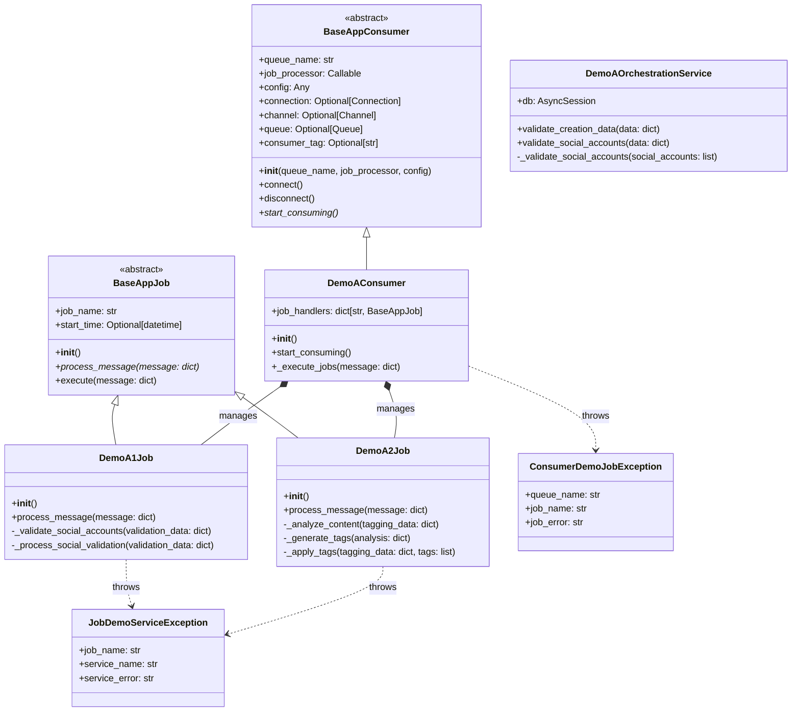
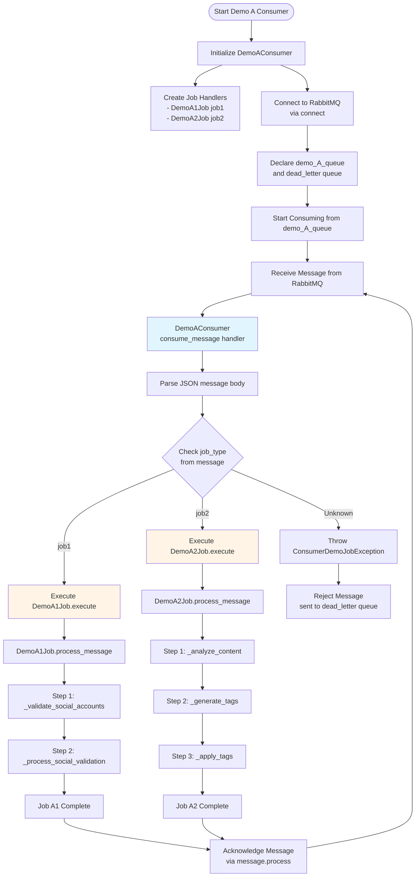
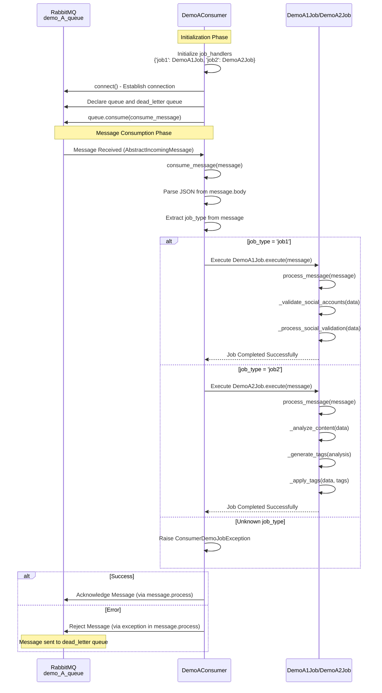

# Demo A - Consumer Job Architecture

## Mermaid Class Diagram

## Flow Diagram

## Sequence Diagram

## Component Overview

### 1. **Base Classes**

#### BaseAppConsumer
- Abstract base class for all consumers
- Handles RabbitMQ connection management using `aio_pika`
- Provides queue declaration (main queue + dead letter queue)
- Manages connection lifecycle (connect/disconnect)
- Sets QoS with prefetch_count=1
- Declares queues with priority support (x-max-priority: 10)
- Takes `job_processor` parameter (though subclasses may override `start_consuming` to handle processing directly)

#### BaseAppJob
- Abstract base class for all jobs
- Provides `execute()` wrapper method with error handling
- Tracks job execution start time
- Logs job execution lifecycle
- Re-raises errors for dead letter queue handling
- Requires subclasses to implement `process_message()` method

### 2. **Demo A Components**

#### DemoAConsumer
- **Purpose**: Handles RabbitMQ connection, message consumption, parsing, routing, and job execution for `demo_A_queue`
- **Functions**:
  - `__init__()`: Initialize consumer with queue name "demo_A_queue", config, and job handlers
  - `start_consuming()`: Start consuming messages with custom message handler
  - `_execute_jobs(message)`: Route to appropriate job handler based on `job_type`
- **Job Handlers**:
  - `'job1'`: Routes to `DemoA1Job` instance (Social Validation)
  - `'job2'`: Routes to `DemoA2Job` instance (Auto Tagging)
- **Message Processing**:
  - Receives messages from RabbitMQ queue
  - Parses JSON message body
  - Routes to appropriate job based on `job_type`
  - Handles message acknowledgment/rejection

#### DemoA1Job (Social Validation)
- **Purpose**: Handle `job_type='job1'` - Social validation workflow
- **Functions**:
  - `execute(message)`: Wrapper method with error handling and metrics
  - `process_message(message)`: Main processing logic
  - `_validate_social_accounts(validation_data)`: Validate social accounts (testing implementation)
  - `_process_social_validation(validation_data)`: Process validation results (testing implementation)
- **Error Handling**: Wraps errors in `JobDemoServiceException`

#### DemoA2Job (Auto Tagging)
- **Purpose**: Handle `job_type='job2'` - Auto tagging workflow
- **Functions**:
  - `execute(message)`: Wrapper method with error handling and metrics
  - `process_message(message)`: Main processing logic
  - `_analyze_content(tagging_data)`: Analyze content for tags (testing implementation)
  - `_generate_tags(analysis)`: Generate tags from analysis (testing implementation)
  - `_apply_tags(tagging_data, tags)`: Apply generated tags (testing implementation)
- **Error Handling**: Wraps errors in `JobDemoServiceException`

#### DemoAOrchestrationService
- **Purpose**: Service layer for Demo A orchestration operations
- **Functions**:
  - `validate_creation_data(data)`: Validates creation data including social accounts, user_id, workspace_id, name, description, age, progress
  - `validate_social_accounts(data)`: Validates social accounts data structure
  - `_validate_social_accounts(social_accounts)`: Private method for detailed social account validation (platform, username, url, followers, verified)
- **Note**: Currently jobs use test implementations, but service is available for future integration

### 3. **Data Flow**

1. **Initialization**: 
   - `DemoAConsumer` is created and initializes job handlers: `{'job1': DemoA1Job(), 'job2': DemoA2Job()}`
   - Consumer connects to RabbitMQ and declares `demo_A_queue` and `demo_A_queue_dead_letter`
   - Consumer calls `queue.consume()` with a message handler function

2. **Message Reception**: 
   - Consumer receives `AbstractIncomingMessage` from RabbitMQ queue
   - Message handler (`consume_message`) is invoked

3. **Message Parsing**: 
   - Consumer parses JSON from `message.body.decode()`
   - Extracts `job_type` from message dictionary

4. **Job Routing**: 
   - Consumer calls `_execute_jobs(message_data)`
   - Looks up job handler in `job_handlers` dictionary using `job_type`
   - If job_type not found, raises `ConsumerDemoJobException`

5. **Job Execution**: 
   - Consumer calls `job_handler.execute(message)` 
   - Job's `execute()` method calls `process_message()` with error handling
   - Job performs its specific workflow steps

6. **Message Acknowledgment**: 
   - On success: Message is automatically acknowledged via `async with message.process()`
   - On error: Exception is raised, message is rejected and sent to dead letter queue

### 4. **Error Handling**

- **JSON Decode Errors**: Caught in `consume_message()`, logged and re-raised (message goes to dead letter queue)
- **Job Execution Errors**: 
  - Caught in job's `execute()` method
  - Wrapped in `JobDemoServiceException` by individual jobs
  - Re-raised to consumer level
- **Unknown Job Type**: Raises `ConsumerDemoJobException` in consumer's `_execute_jobs()`
- **All Errors**: Re-raised for debugging, causing message to be rejected and sent to `demo_A_queue_dead_letter`

### 5. **Queue Configuration**

- **Main Queue**: `demo_A_queue`
  - Durable: `True`
  - Auto-delete: `False`
  - Priority support: `x-max-priority: 10`
- **Dead Letter Queue**: `demo_A_queue_dead_letter`
  - Durable: `True`
  - Auto-delete: `False`
  - Priority support: `x-max-priority: 10`
- **QoS**: Prefetch count set to 1 (process one message at a time)

### 6. **Running the Consumer**

The consumer is run as a standalone service via `app/worker/demo_A_worker.py`:
- Creates `DemoAConsumer` instance
- Connects to RabbitMQ via `consumer.connect()`
- Starts consuming messages via `consumer.start_consuming()`
- Runs indefinitely until interrupted (Ctrl+C)
- Gracefully disconnects on shutdown

**Note**: Despite the filename `demo_A_worker.py`, this is actually a run script for `DemoAConsumer`, not a worker class. The consumer handles all aspects of message processing directly.