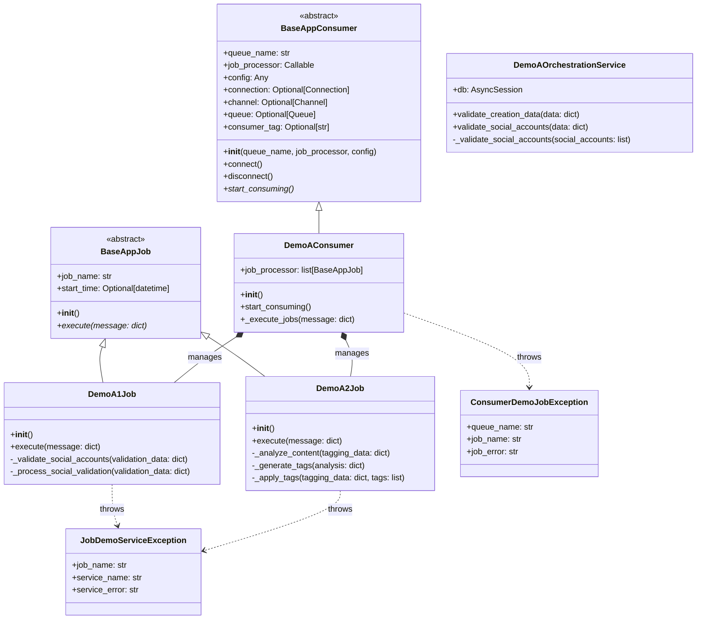
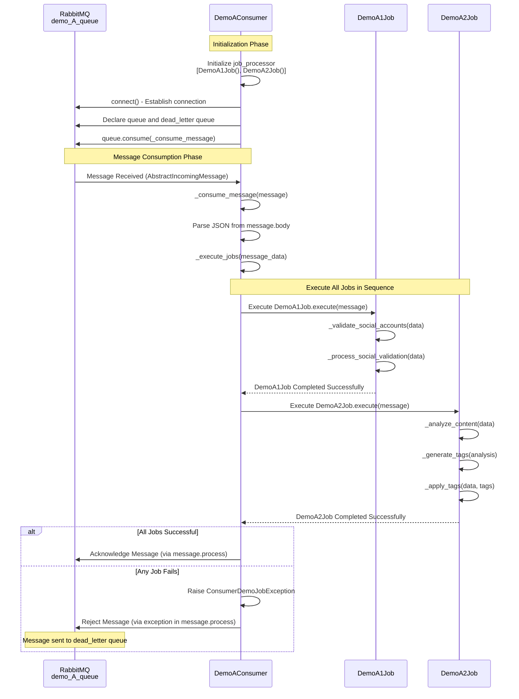

# Demo A - Consumer Job Architecture

## Mermaid Class Diagram



## Flow Diagram

```mermaid
flowchart TD
    Start([Start Demo A Consumer]) --> Init[Initialize DemoAConsumer]
    Init --> CreateJobs[Create Job Processor<br/>[DemoA1Job, DemoA2Job]]
    
    Init --> Connect[Connect to RabbitMQ<br/>via connect]
    Connect --> DeclareQueue[Declare demo_A_queue<br/>and dead_letter queue]
    DeclareQueue --> StartConsuming[Start Consuming from demo_A_queue]
    
    StartConsuming --> ReceiveMsg[Receive Message from RabbitMQ]
    ReceiveMsg --> ConsumerProcess[DemoAConsumer<br/>_consume_message handler]
    
    ConsumerProcess --> ParseJSON[Parse JSON message body]
    ParseJSON --> ExecuteJobs[Execute All Jobs in job_processor]
    
    ExecuteJobs --> ExecuteA1[Execute DemoA1Job.execute]
    ExecuteA1 --> A1Step1[Step 1: _validate_social_accounts]
    A1Step1 --> A1Step2[Step 2: _process_social_validation]
    A1Step2 --> A1Complete[DemoA1Job Complete]
    
    A1Complete --> ExecuteA2[Execute DemoA2Job.execute]
    ExecuteA2 --> A2Step1[Step 1: _analyze_content]
    A2Step1 --> A2Step2[Step 2: _generate_tags]
    A2Step2 --> A2Step3[Step 3: _apply_tags]
    A2Step3 --> A2Complete[DemoA2Job Complete]
    
    A2Complete --> AckMsg[Acknowledge Message<br/>via message.process]
    ExecuteJobs -->|Error| JobError[Throw ConsumerDemoJobException]
    JobError --> RejectMsg[Reject Message<br/>sent to dead_letter queue]
    
    AckMsg --> ReceiveMsg
    
    style ExecuteA1 fill:#fff4e6
    style ExecuteA2 fill:#fff4e6
    style ConsumerProcess fill:#e1f5ff
    style ExecuteJobs fill:#e8f5e9
```

## Sequence Diagram



## Component Overview

### 1. **Base Classes**

#### BaseAppConsumer
- Abstract base class for all consumers
- Handles RabbitMQ connection management using `aio_pika`
- Provides queue declaration (main queue + dead letter queue)
- Manages connection lifecycle (connect/disconnect)
- Sets QoS with prefetch_count=1
- Declares queues with priority support (x-max-priority: 10)
- Takes `job_processor` parameter (though subclasses may override `start_consuming` to handle processing directly)

#### BaseAppJob
- Abstract base class for all jobs
- Tracks job execution start time
- Logs job execution lifecycle
- Requires subclasses to implement `execute()` method
- Subclasses handle their own error handling and wrap errors in `JobDemoServiceException`

### 2. **Demo A Components**

#### DemoAConsumer
- **Purpose**: Handles RabbitMQ connection, message consumption, parsing, and job execution for `demo_A_queue`
- **Functions**:
  - `__init__()`: Initialize consumer with queue name "demo_A_queue", config, and job processor (list of jobs)
  - `start_consuming()`: Start consuming messages using base class `_consume_message` handler
  - `_execute_jobs(message)`: Execute all jobs in `job_processor` sequentially
- **Job Processor**:
  - `job_processor`: List containing `[DemoA1Job(), DemoA2Job()]`
  - All jobs in the processor are executed automatically for every message
  - Jobs execute in sequence: DemoA1Job → DemoA2Job
- **Message Processing**:
  - Receives messages from RabbitMQ queue
  - Parses JSON message body (no `job_type` required)
  - Automatically executes all jobs in `job_processor` list
  - Handles message acknowledgment/rejection

#### DemoA1Job (Social Validation)
- **Purpose**: Social validation workflow - automatically executed for every message
- **Functions**:
  - `execute(message)`: Main processing method with error handling
  - `_validate_social_accounts(validation_data)`: Validate social accounts (testing implementation)
  - `_process_social_validation(validation_data)`: Process validation results (testing implementation)
- **Error Handling**: Wraps errors in `JobDemoServiceException`

#### DemoA2Job (Auto Tagging)
- **Purpose**: Auto tagging workflow - automatically executed for every message (after DemoA1Job)
- **Functions**:
  - `execute(message)`: Main processing method with error handling
  - `_analyze_content(tagging_data)`: Analyze content for tags (testing implementation)
  - `_generate_tags(analysis)`: Generate tags from analysis (testing implementation)
  - `_apply_tags(tagging_data, tags)`: Apply generated tags (testing implementation)
- **Error Handling**: Wraps errors in `JobDemoServiceException`

#### DemoAOrchestrationService
- **Purpose**: Service layer for Demo A orchestration operations
- **Functions**:
  - `validate_creation_data(data)`: Validates creation data including social accounts, user_id, workspace_id, name, description, age, progress
  - `validate_social_accounts(data)`: Validates social accounts data structure
  - `_validate_social_accounts(social_accounts)`: Private method for detailed social account validation (platform, username, url, followers, verified)
- **Note**: Currently jobs use test implementations, but service is available for future integration

### 3. **Data Flow**

1. **Initialization**: 
   - `DemoAConsumer` is created and initializes `job_processor` as a list: `[DemoA1Job(), DemoA2Job()]`
   - Consumer connects to RabbitMQ and declares `demo_A_queue` and `demo_A_queue_dlx`
   - Consumer calls `queue.consume()` with `_consume_message` handler from base class

2. **Message Reception**: 
   - Consumer receives `AbstractIncomingMessage` from RabbitMQ queue
   - Base class `_consume_message` handler is invoked

3. **Message Parsing**: 
   - Consumer parses JSON from `message.body.decode()`
   - Message body only needs to contain `data` field (no `job_type` required)

4. **Job Execution**: 
   - Consumer calls `_execute_jobs(message_data)`
   - Iterates through all jobs in `job_processor` list
   - Executes each job sequentially: DemoA1Job → DemoA2Job
   - Each job's `execute(message)` method is called with the full message

5. **Job Processing**: 
   - Each job's `execute()` method performs its specific workflow steps
   - Jobs handle their own error handling and wrap errors in `JobDemoServiceException`
   - If any job fails, execution stops and exception is raised

6. **Message Acknowledgment**: 
   - On success (all jobs complete): Message is automatically acknowledged via `async with message.process()`
   - On error (any job fails): Exception is raised, message is rejected and sent to dead letter queue

### 4. **Error Handling**

- **JSON Decode Errors**: Caught in `_consume_message()`, logged and re-raised (message goes to dead letter queue)
- **Job Execution Errors**: 
  - Caught in job's `execute()` method
  - Wrapped in `JobDemoServiceException` by individual jobs
  - Re-raised to consumer level as `ConsumerDemoJobException`
  - If any job fails, remaining jobs in the processor are not executed
- **All Errors**: Re-raised for debugging, causing message to be rejected and sent to `demo_A_queue_dlx`

### 5. **Queue Configuration**

- **Main Queue**: `demo_A_queue`
  - Durable: `True`
  - Auto-delete: `False`
  - Priority support: `x-max-priority: 10`
- **Dead Letter Queue**: `demo_A_queue_dlx`
  - Durable: `True`
  - Auto-delete: `False`
  - Priority support: `x-max-priority: 10`
- **QoS**: Prefetch count set to 1 (process one message at a time)

### 6. **Running the Consumer**

The consumer is run as a standalone service via `app/worker/demo_A_worker.py`:
- Creates `DemoAConsumer` instance
- Connects to RabbitMQ via `consumer.connect()`
- Starts consuming messages via `consumer.start_consuming()`
- Runs indefinitely until interrupted (Ctrl+C)
- Gracefully disconnects on shutdown

**Note**: Despite the filename `demo_A_worker.py`, this is actually a run script for `DemoAConsumer`, not a worker class. The consumer handles all aspects of message processing directly.

### 7. **Message Format**

Messages sent to `demo_A_queue` should follow this format:

```json
{
  "data": {
    // Any data required by the jobs
    // No job_type field needed
  }
}
```

**Important**: 
- Messages no longer require a `job_type` field
- All jobs in the consumer's `job_processor` are automatically executed for every message
- For DemoAConsumer, both DemoA1Job and DemoA2Job will execute in sequence for each message